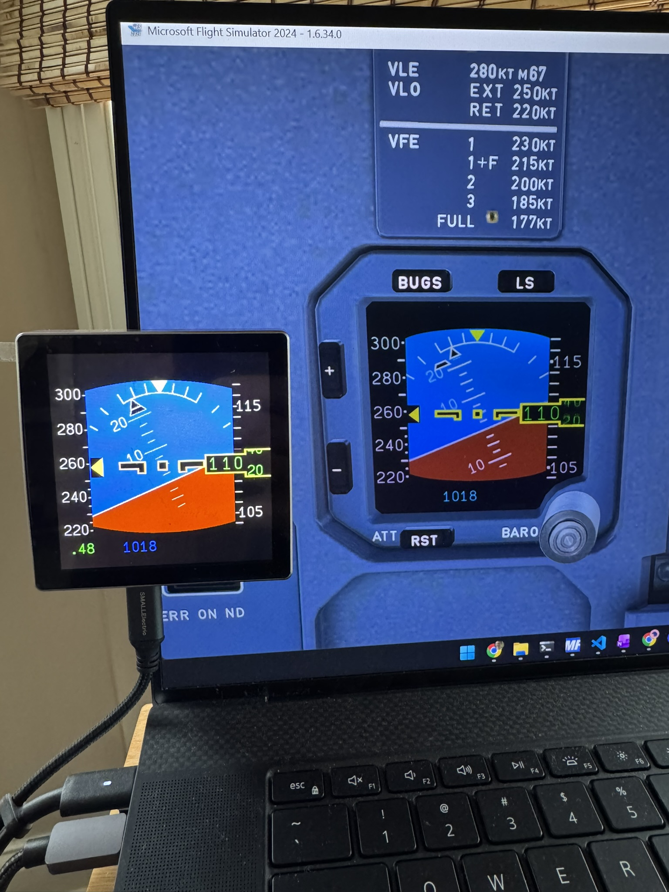

# CC_ISIS — A320 Standalone Standby Instrument for MobiFlight

An A320-style ISIS (Integrated Standby Instrument System) implemented as a
[MobiFlight](https://www.mobiflight.com) Community Device on an ESP32-S3 with
a 4-inch LCD.



---

## Working Features

- Horizon / attitude display
- Speed tape
- Mach speed display (shown above 0.45 M)
- Altitude tape with rolling numeric display (NEG indicator)
- Kohlsman / QNH setting
- Slip/skid indicator ("ball")

## Planned

- LS display (CDI deviation diamonds)
- Speed / altitude bugs and bug menu
- Button handling
- Boeing ISFD graphics variant

---

## Installation

### Step 1 — Flash the firmware

Use the browser-based installer — no software installation required.
Works in Chrome and Edge on desktop.

**[➜ Open Web Installer](https://ccrawford.github.io/CC_ISIS/web-installer/)**

Connect your ESP32-S3 via USB, click the link above, then click **Install**
and select the correct COM port when prompted.

---

### Step 2 — Install the MobiFlight Community files

The Community package contains the device definition and board configuration
that MobiFlight Connector needs to recognise the CC_ISIS.

**Download the latest release ZIP** from the
[Releases page](https://github.com/ccrawford/CC_ISIS/releases) —
it will be named something like `CC_ISIS_1.0.0.zip`.

Inside the ZIP is a single folder called `CC_ISIS`. Copy that folder into
your MobiFlight Community directory:

| OS | Default Community folder path |
|---|---|
| Windows | `%LOCALAPPDATA%\MobiFlight\MobiFlight Connector\Community\` |

After copying, the layout should look like this:

```
Community\
  CC_ISIS\
    boards\
      CC_ISIS_ESP32_S3.board.json
    devices\
      CC_ISIS.device.json
    firmware\
      ccrawford_cc_isis_esp32s3_merged_<version>.bin
```

> **Tip:** You can paste `%LOCALAPPDATA%\MobiFlight\MobiFlight Connector\Community\`
> directly into the Windows Explorer address bar to open the folder.

---

### Step 3 — Open the MobiFlight project

Open **`MF/ISIS FBW CONFIG.mfproj`** (included in this repository) in
MobiFlight Connector. This project is pre-configured for the FlyByWire A320
in MSFS and maps all simulator variables to the CC_ISIS device outputs.

1. In MobiFlight Connector choose **File → Open** and select `ISIS FBW CONFIG.mfproj`.
2. Connect the CC_ISIS device via USB — it should appear automatically.
3. Click **Run** in MobiFlight Connector.

---

## Links

- [GitHub Repository](https://github.com/ccrawford/CC_ISIS)
- [Web Installer](https://ccrawford.github.io/CC_ISIS/web-installer/)
- [MobiFlight](https://www.mobiflight.com)
- [FlyByWire A32NX](https://flybywiresim.com)
